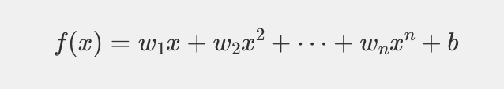
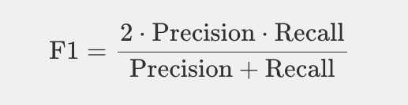
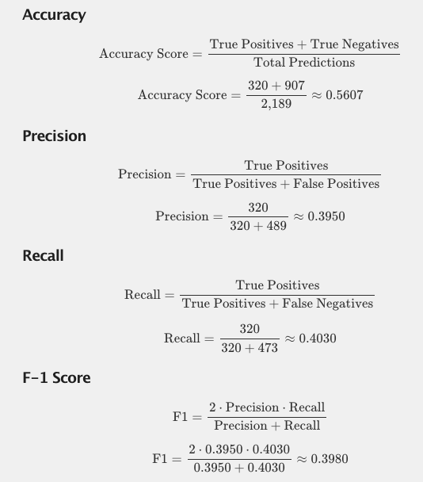
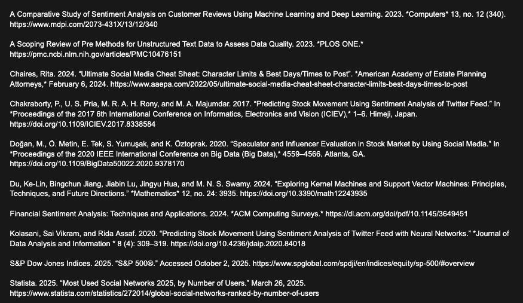

# Welcome to Our Project
Use your arrow keys to navigate

---

### Using Twitter Sentiment Analysis to Predict Stock Price Movements of Major Companies via Support Vector Machines

##### Authors: Chris Charro, Hunter Clayton, Camille Esteves

---

# Introduction

---

### Background & Motivation

- Twitter(X) generates millions of real-time posts expressing public opinion.
- Investor sentiment can influence short-term stock movements.
- This project examines whether Twitter sentiment can help predict next-day stock direction.

---

### Research Problem

- Traditional financial indicators do not fully capture rapid shifts in public sentiment.
- We investigate:
  - Whether tweet sentiment can be quantified reliably.
  - Whether sentiment correlates with next-day stock movement.
  - Whether SVM can convert sentiment into accurate predictions of future stock price.

---

### Project Overview

- Collect tweets referencing major publicly traded companies.
- Apply multiple sentiment methods (VADER, finVADER, finBERT).
- Compare automated sentiment to manual labeling.
- Train an SVM model to predict next-day stock direction.
- Evaluate with accuracy, precision, recall, F1, and ROC curves.

---

### Sentiment Analysis

- Sentiment analysis is the process of analyzing text to derive the underlying emotions being expressed in a collection of data.
- Allows companies to understand how stakeholders ***feel*** about their brand, products, or direction at a large scale.
- Used across a variety of industries including technology, finance, and retail.

---

### Twitter(X)'s Role & Advantages for Sentiment Analysis

- With over 586 million active users, Twitter(X) contains a wealth of user sentiment from all over the globe.
- Every day, millions of users flock to the site to share their opinions, news, humor, and feelings about a multitude of topics.

---

### Twitter(X)'s Role & Advantages for Sentiment Analysis (Continued)

- With a maximum character limit of 280, Twitter(X) is the premier social media site for short-form content.
  - Short form content has several benefits for sentiment analysis:
    - Less computationally intensive.
    - Reduced storage requirements.
    - Greater availability of training data.

---

### Why is Sentiment Analysis Important?

- The constant flow of data makes Twitter(X) an invaluable resource for analyzing trends in public sentiment.
- In financial markets, these sentiments can serve as indicators of investor confidence, public reactions, and potential price fluctuations.
- Prior studies demonstrate that analyzing sentiment from Twitter posts can effectively reflect investor sentiment and broader market trends.

---

### Goal of our project

*Perform sentiment analysis on Twitter(X) data related to publicly traded companies to determine the possibility and accuracy of predicting the price movements of stock prices based on user sentiment.*

---

# METHODS

---

### Sentiment Analysis

- We selected three primary methods for sentiment analysis:
  - VADER
  - finVADER
  - finBERT

---

### VADER

- Developed in 2014 by C.J. Hutto and Eric Gilbert at Georgia Tech.
- Lexicon-based with a library of common words and phrases.
- Designed specifically for micro-blog style text.
- Requires no training data → extremely fast.

---

### finVADER

- Developed in 2023 by Petr Koráb.
- Open-source adaptation of VADER with financial domain-specific lexicons.
- Trained on financial texts including news, earnings reports, and finance tweets.

---

### BERT

- Deep learning language model developed by Google in 2018.
- Introduced bidirectional transformers.
- Excels at contextual language understanding.

---

### finBERT

- Open-source, domain-specific adaptation of BERT introduced by Dogu Tan Araci in 2019.
- Pre-trained and fine-tuned on financial texts.
- More accurate for financial terminology but computationally heavier.

---

### Support Vector Machines (SVM)

- Once sentiment analysis is complete, SVM is used to make predictions on stock price movement.
  - SVM is a supervised machine learning method that excels in classification tasks.
  - Commonly used in financial research for detecting patterns.

---

### Support Vector Machines (SVM)

- The features **x** represent the variables used for next-day prediction.
- The feature weights **w** represent how strongly the model separates upward and downward movement classes.
- The bias term **b** shifts the decision boundary to improve classification accuracy.

---

### SVM Model Setup

- Features used:
  - Sentiment scores
  - Lagged stock price movement
  - Date-based indicators
- RBF kernel selected for its ability to capture nonlinear patterns in the data.
- Balanced class weights applied.
- Predicts next-day “up” or “down.” stock price movement.

---

### Evaluation Metrics

- Accuracy: Of all predictions made, how many were correct?

---

### Evaluation Metrics

- Precision: Of all predicted positives, how many were correct?

---

### Evaluation Metrics

- Recall: Of all actual positives, how many were detected?

---

### Evaluation Metrics

- F-1 Score: Balances precision and recall.

---

# ANALYSIS & RESULTS

---

### Data Collection & Preprocessing

- Data gathered from:
  - NASDAQ daily stock price data
  - Twitter(X) posts filtered by company tickers
- Tweet preprocessing included:
  - Removing links, emojis, punctuation
  - Lowercasing
  - Removing stopwords
- Stock prices were converted into binary “up” or “down” labels.

---

### Why Compare Multiple Sentiment Methods?

- Each model captures sentiment differently:
  - VADER: Fast, general-purpose social media lexicon.
  - finVADER: Adds financial terminology.
  - finBERT: Deep learning model providing contextual accuracy.
- Comparing methods highlights tradeoffs and identifies the strongest predictor.

---

### Manual Labeling Comparison

- A subset of 200 tweets was manually labeled for evaluation.
- Comparing automated vs. manual label distributions provides a human-quality benchmark.

---

#### Sentiment Analysis Class Distributions

---

#### Sentiment Analysis Class Distributions Interpretation
- Manual labels show roughly 39% positive, 44% neutral, and 17% negative tweets.
- VADER most closely matched the manual distribution across all three classes (positive, neutral, and negative).
- finVADER favored the neutral class and underestimated positive and negative sentiment.
- finBERT overwhelming favored the neutral class with under 13% positive and negative identification.

---

#### Sentiment Analysis Class Distributions Interpretation (Continued)

- Overall, VADER was chosen for the final model as it most closely aligned with the distribution of manual sentiment analysis.

---

#### SVM Stock Market Prediction Results

---

### Confusion Matrix (Interpretation)

- TN = 907: model correctly predicted many downward movements.
- TP = 320: upward movements correctly predicted but lower volume.
- FP = 489: predicted ‘up’ when price fell.
- FN = 473: predicted ‘down’ when price rose.
- High FN count matches low precision/recall for upward movement.

---

---

### Model Performance Summary

- **Accuracy ≈ 0.5607** indicates moderate overall performance.
- **Precision ≈ 0.3950** shows difficulty predicting true upward movements.
- **Recall ≈ 0.4030** indicates limited ability to detect actual upward movement cases.
- **F1 ≈ 0.3980** reflects the model’s weak balance between precision and recall.

---

### ROC Curve

---

### ROC Curve Interpretation

- The ROC curve has an AUC of approximately **0.54**, only slightly above random guessing (0.50).
- The curve stays close to the diagonal line, indicating weak discriminatory ability.
- The model struggles to meaningfully separate upward vs. downward price movements.

---

### ROC Curve Interpretation (Continued)

- This performance is typical for next-day prediction tasks using sentiment alone, as market movement is influenced by many factors beyond public sentiment.
- While the model shows minor improvement over chance, the ROC confirms that predictive power remains limited.

---

# CONCLUSION

---

### Key Takeaways

- Twitter(X) provides a valuable real-time snapshot of public sentiment, but sentiment alone is not a strong predictor of next-day stock movement.
- Among sentiment methods, **VADER most closely matched manual sentiment**, while **finBERT** produced highly neutral-leaning classifications.
- The SVM model using an **RBF kernel** achieved moderate accuracy (**≈ 56%**), with notable difficulty identifying upward movements.

---

### Model Performance Insights

- High false negatives indicate the model frequently missed actual price increases.
- Precision, recall, and F1 all fell below **0.41**, confirming limited predictive strength.
- The ROC curve (**AUC ≈ 0.54**) shows performance only slightly above random guessing.
- These results highlight the difficulty of forecasting short-term market behavior using sentiment alone.

---

### Limitations

- Tweet sentiment may not reflect the full spectrum of investor behavior.
- Bots, spam, and noisy social media language introduce additional variability.
- Using only next-day binary movement oversimplifies complex market dynamics.
- Market movement is heavily influenced by external factors not captured in tweets.

---

### Future Work

- Incorporate additional financial indicators (volume, volatility indices, macroeconomic trends).
- Explore more advanced machine learning models (LSTM, transformers, ensemble methods).
- Analyze longer prediction windows (multi-day or weekly movement).
- Experiment with more robust sentiment models and richer tweet metadata (engagement metrics, verified accounts, timestamps).

---

### Final Remarks

- While sentiment analysis offers valuable insights, predicting stock prices requires a more comprehensive feature set.
- This study shows that sentiment contributes *some* signal, but sentiment alone is not enough for reliable next-day prediction.
- Future enhancements can build on this foundation to explore deeper relationships between public opinion and market activity.

---

#### References

---

#### References

---

